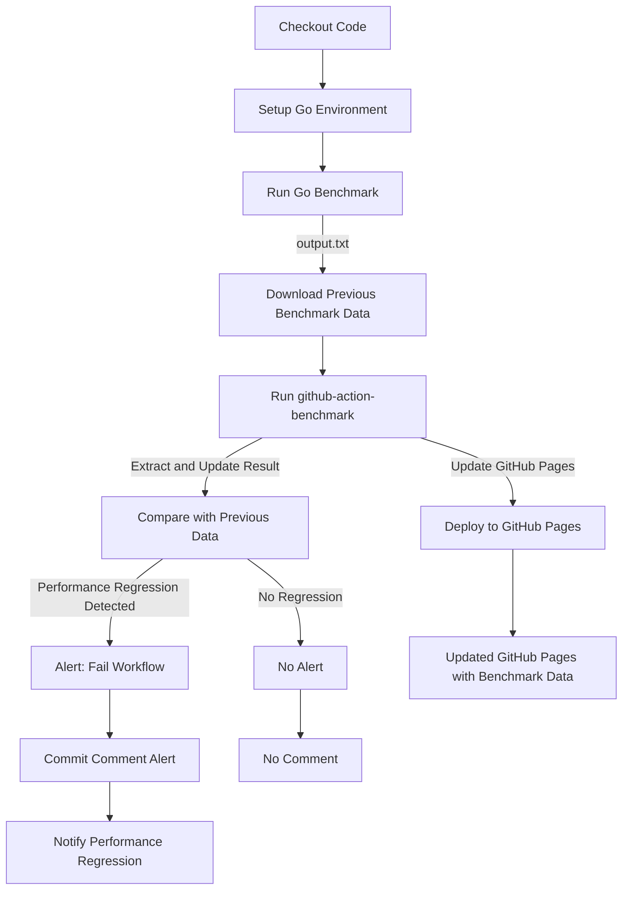
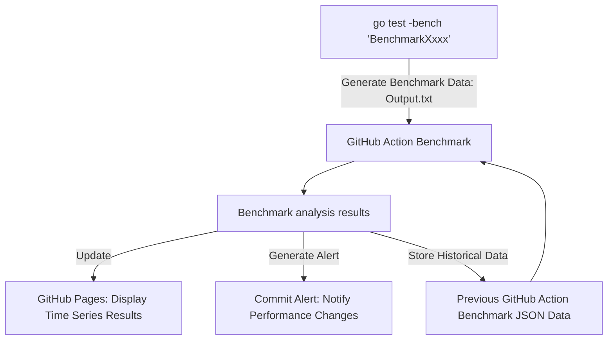

# benchmark-action

A reusable and continuous benchmarking action for go code validating PRs and commit history. 

This action uses https://github.com/benchmark-action/github-action-benchmark/blob/master/README.md

github-action-benchmark works as follows:

Diving deeper into the inputs/outputs for the benchmarking action:

This gives us almost everything we need, with one caveat. The standard usage of this action makes working with PRs untenable, since benchmarking data from feature work can pollute the historical data store that future feature work will be compared against. To work around this, we won't update the historical data store for PRs, only for merges. (Open question: how will we display the analysis data for PRs then?)

To reuse this action across repos, we offer consumers the following inputs:
- A list of benchmarks to run, specified in the PR description by developers with the format `\nBENCHMARKS: BenchmarkOne, BenchmarkTwo`
- A flag to opt-in to using Github Pages, which requires a one-time setup burden from a contributor with write access

Benchmarking requires historical data. Historical data requires continuous benchmark analyses, which will may increase github spend per merge for the additional compute. PR developers may experience CI latency.

## Open Questions
- How to display analysis data for PRs?
- How to get reproducible environments to ensure precision of results over time?